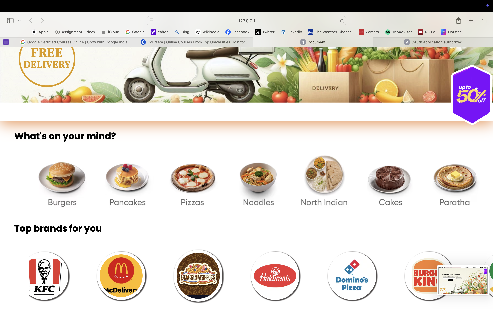

# 🍔 YumRider - Food Delivery Web UI

  
<strong>YumRider</strong> is a simple, responsive landing page for a food delivery service. Built using only HTML and CSS, it showcases a clean UI with search functionality, offers, food categories, and brand sections.

  <h2>🚀 Key Features</h2>
  <ul>
    <li>Sticky navigation bar with logo and quick links</li>
    <li>Search bar for food and location</li>
    <li>GIFs for visual appeal</li>
    <li>Horizontally scrollable food categories and top brands</li>
    <li>Modern layout using Flexbox</li>
    <li>Responsive design</li>
  </ul>

  <h2>🛠️ Tech Stack</h2>
  <ul>
    <li><strong>Languages:</strong> HTML5, CSS3</li>
    <li><strong>Fonts:</strong> Google Fonts (Poppins, Bona Nova SC, Quicksand)</li>
    <li><strong>Media:</strong> GIFs from Giphy</li>
  </ul>

  <h2>Frontend Preview</h2>
  
A snapshot of the YumRider landing page:

  
  

  <h2>📚 What I Learned</h2>
  <ul>
    <li>Creating responsive layouts using Flexbox</li>
    <li>Handling scrollable sections with overflow control</li>
    <li>Importing and using custom fonts</li>
    <li>Improving visual design with animations and hover effects</li>
  </ul>

  <h2>▶️ Getting Started</h2>
  <ol>
    <li>Download or clone this repository</li>
    <li>Place images and GIFs inside the <code>images/</code> folder</li>
    <li>Open <code>index.html</code> in a browser to view the project</li>
  </ol>

  <h2> About the Creator</h2>
  

    <strong>Vansh Chopra</strong> 
    B.Tech CSE, Delhi Technological University 
    This project was created as part of my first semester frontend learning.
  

